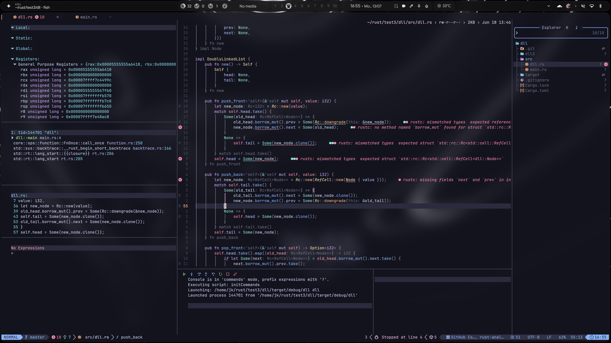

  

# My Visual Studio Code, IDEA Vim and NeoVim (LazyVim) setting on Windows and Linux (Ubuntu and Arch)

This repository contains my personal **Visual Studio Code / IDEA Vim / NeoVim (LazyVim) settings**.

> ⚠️ **Important:**
> This repo was not created for public distribution.
> It is intended only for my own use, so I can use my settings on another computer without logging into my GitHub account.

new:

- [`JK Arch`](my-arch-jk.md)

old:

- [`NeoVim Ubuntu`](README-neovim-config-Ubuntu.md)  
- [`NeoVim Arch`](README-neovim-config-Arch.md)
- [`Windows WSL NeoVim`](README-neovim-config-windows-ubuntu-wsl.md)
- [`IDEA Vim`](README-idea-config.md)  
- [`VS Code`](README-vs-code-config.md)
- [`License`](LICENSE)

## Disclaimer

These settings are provided **as-is**, without any warranty.

I am **not responsible** for any issues, errors, or damage that may occur from using them, including but not limited to:

* configuration problems
* loss of data
* software issues
* compatibility problems

Use them **at your own risk**.

## License

This repository is primarily licensed under the **Apache License 2.0**.

Some files are distributed under different licenses:
- `general.lua` and `execs.lua` is licensed under **GNU General Public License v3.0-only (GPL-3.0-only)** because it contains modifications based on:
  https://github.com/end-4/dots-hyprland

## Notes

* Some settings may be system-specific (Windows vs Linux).
* This configuration is tailored to my personal workflow and may not suit everyone.
